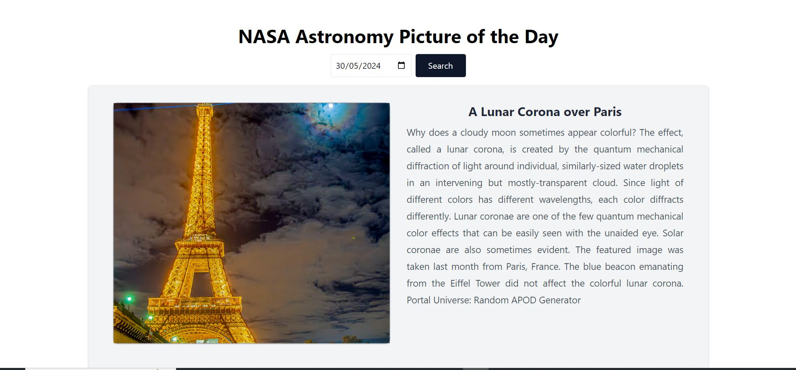

# NASA APOD

## Description
 NASA Image Explorer with React & TypeScript

 ## Instructions to run this app in my computer

- how to install dependencies (`npm install`)
- how to run the application (eg. `npm run dev`)

## Demo

[Project Demo](https://fetch-nasa-apod.netlify.app/)

## Screenshots

### Home Page
